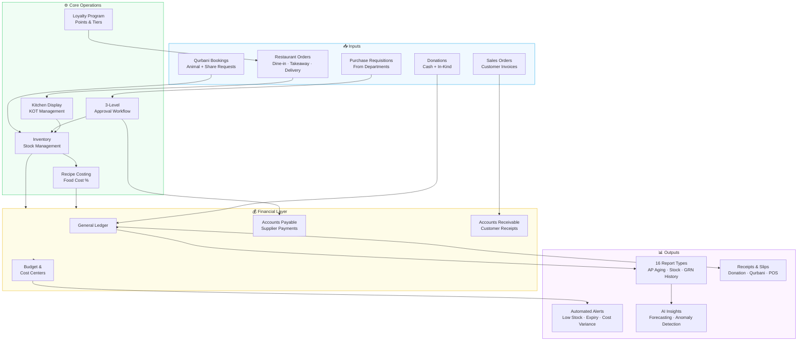
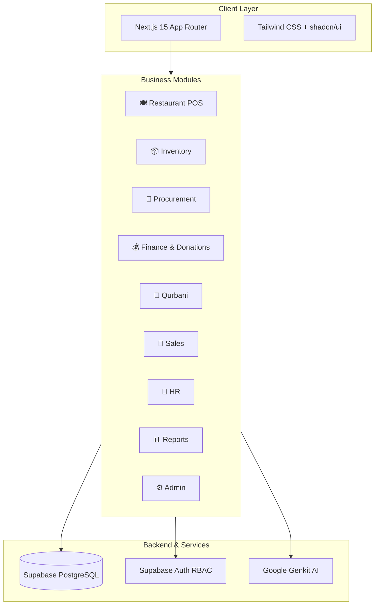
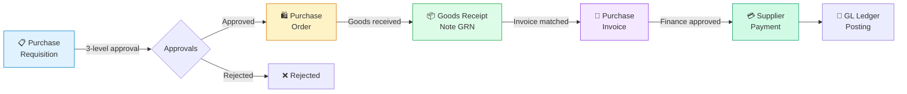
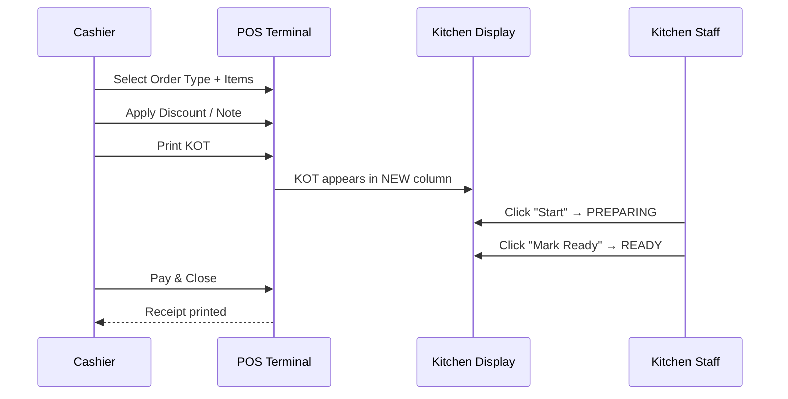
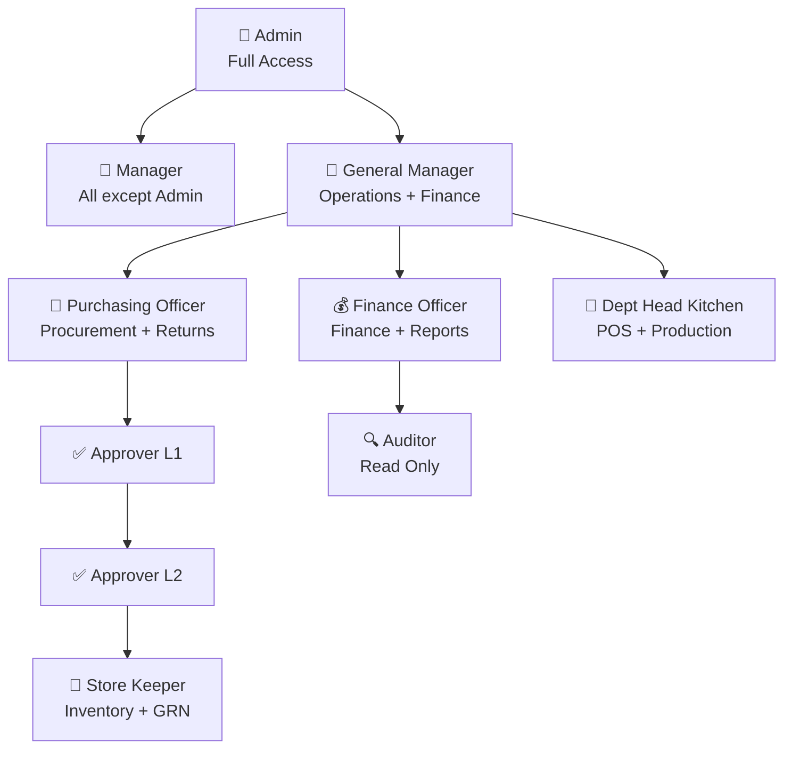
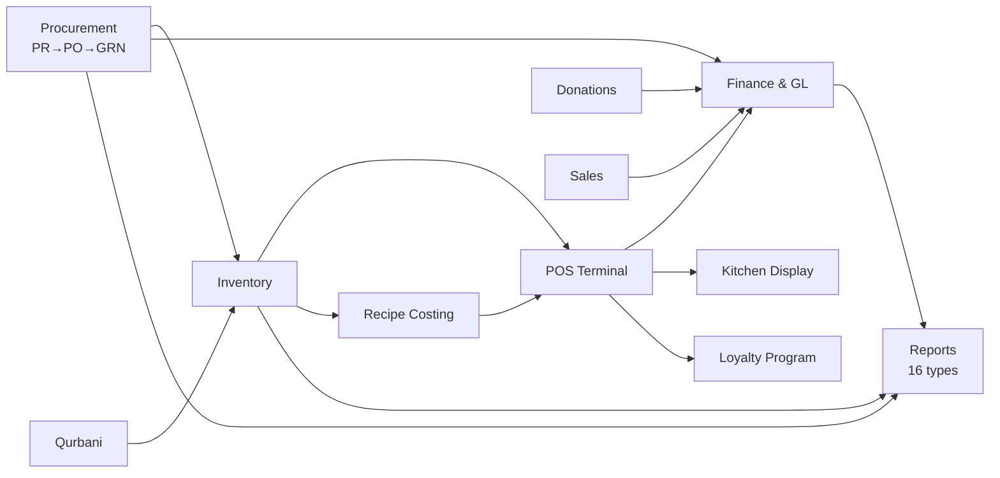

# Rahah24 ERP — AI-Enabled Enterprise Resource Planning Platform

> **راحت آپ کے لئے، حساب ہمارے لئے**
> *Comfort for you, accountability for us.*

Rahah24 ERP is a comprehensive, AI-enabled management platform designed for **Jamia Binoria Aalamia** (SITE, Karachi). It unifies restaurant operations, inventory, procurement, donations, finance, HR, and Islamic services into a single cloud-based system.

---

## Technology Stack

| Layer | Technology |
|---|---|
| Framework | Next.js 15.3.3 (App Router) |
| UI | React 18 + TypeScript |
| Styling | Tailwind CSS + shadcn/ui (Radix UI) |
| Charts | Recharts |
| AI | Google Genkit (Gemini 2.0 Flash) |
| Database | Supabase (PostgreSQL) |
| Auth | Supabase Auth + RBAC |
| State | Tanstack React Query |
| Dev Server | Turbopack (port 9002) |

---

## How the ERP Works



---

## System Architecture



---

## Procurement Workflow



---

## POS Order Flow



---

## User Role Hierarchy



---

## Module Dependency Map



---

## Getting Started

### Prerequisites
- Node.js 18+
- npm or yarn

### Installation
```bash
npm install
npm run dev        # http://localhost:9002
npm run build      # Production build
npm run typecheck  # TypeScript check
```

### Demo Login
```
Email:    admin@rahah24.com
Password: Admin123!@#
```
Or use the quick-login chips on the landing page (Admin / Manager / Finance).

---

## Implemented Modules

### 1. Restaurant POS & Operations
Full point-of-sale system for a Pakistani restaurant.

| Page | Description |
|---|---|
| POS Terminal | 3-panel terminal: order types, menu grid, cart + payment |
| Kitchen Display | Live KDS — NEW / PREPARING / READY columns with timers |
| Table Management | Visual floor plan, zone filters, status tracking |
| Order History | 15+ orders, all 6 types, receipt dialog |
| KOT History | Kitchen Order Ticket log with reprint |
| Menu Management | 50 Pakistani dishes, Urdu names, spicy dots, margin calc |
| Combo Deals | 8 combo bundles with save %, bestseller badges |
| Loyalty Program | Silver / Gold / Platinum tiers, points, redeem dialog |
| Cashier Shift | Open/close shift, cash count, variance, Z-report |
| Voids & Refunds | Manager PIN auth, audit trail |
| Event Booking | Calendar UI, hall selector |

**Order Types**: Takeaway · Dine-in · Delivery · Booking · Mess · Staff
**Payments**: Cash · Card · JazzCash · Easypaisa · Bank Transfer

---

### 2. Inventory Management (14 Sub-Modules)
Complete warehouse and stock management system.

- Inventory Dashboard with KPIs
- Stock Levels (multi-location)
- Stock Issues, Transfers, Adjustments
- Physical Stock Count with variance
- Items Master & Categories
- Recipe Costing (BOM, ideal vs actual, food cost %)
- Reports & Alerts

---

### 3. Procurement & Purchasing
End-to-end purchasing workflow: PR → PO → GRN → Invoice → Payment.

- Purchase Requisitions (PR-YYYYMM-NNNN)
- Purchase Orders (PO-YYYYMM-NNNN)
- Goods Receipt Notes (GRN-YYYYMM-NNNN)
- Purchase Invoices (PINV-YYYYMM-NNNN)
- Supplier Payments
- Vendor / Supplier Master

---

### 4. Approvals
Multi-level approval workflow system.

- Pending Approvals queue (SLA progress bars)
- Approve Requisitions, Returns, Finance, Payments, Inventory
- Approval History (unified log matching real ERP)

---

### 5. Finance & Donations
- Finance Overview (Cost Centers)
- Donation Entry (cash + in-kind)
- Donor Management
- Income, Expenses, Cashbook, Budget
- Zakat Management

---

### 6. Qurbani Management (Islamic Services)
- Animal tracking (Cow, Goat) with share allocation
- Booking, Slips, Costing, Distribution

---

### 7. Sales
- Customer Orders, Delivery Notes
- Sales Invoices, Customer Receipts
- Customer Master

---

### 8. Production
- Bill of Materials (BOM)
- Work Orders with yield management

---

### 9. Returns
- Purchase Returns (PR-2026-NNNN workflow)
- Sales Returns

---

### 10. Reports (16 types)
AP Aging · Stock Position · Stock Ledger · Low Stock · Expiry Alerts · Price History · Dept Performance · Recipe Variance · PO List · GRN History · Invoice History · Internal Requisitions · Stock Valuation · Vendor Performance · Report Builder

---

### 11. Admin Panel
- Company Settings (multi-entity)
- Role Master & Permissions Matrix
- User Management
- Warehouse Configuration
- Workflow Configuration
- Audit Log

---

## Navigation Structure

```
Dashboard
├── Point of Sale
│   ├── POS Terminal
│   ├── Kitchen Display
│   ├── Table Management
│   ├── Order History
│   ├── KOT History
│   ├── Menu Management
│   ├── Combo Deals
│   ├── Loyalty Program
│   ├── Cashier Shift
│   ├── Voids & Refunds
│   └── Event Booking
├── Procurement
│   ├── Purchase Requisitions
│   ├── Purchase Orders
│   ├── Goods Receipt Notes
│   ├── Purchase Invoices
│   ├── Supplier Payments
│   └── Vendors / Suppliers
├── Approvals
│   ├── Pending Approvals
│   ├── Approve Requisitions / Returns / Finance / Payments / Inventory
│   └── Approval History
├── Inventory (14 sub-modules)
├── Production (BOM, Work Orders)
├── Sales (Orders, Invoices, Receipts)
├── Returns (Purchase, Sales)
├── Finance & Donations
├── Qurbani Management
├── Reports (16 types)
├── Alerts
└── Admin (Users, Roles, Settings, Audit)
```

---

## User Roles

| Role | Access |
|---|---|
| admin | Full system access |
| manager | All modules except admin |
| gm | Procurement, Approvals, Finance, POS, Sales, Reports |
| purchasing_officer | Procurement, Approvals, Inventory, Returns |
| approver_l1 / l2 | Procurement, Approvals, Inventory |
| store_keeper | Procurement, Approvals, Inventory |
| finance_officer | Finance, Donations, Procurement, Reports |
| dept_head_kitchen | POS, Inventory, Production, Procurement |
| auditor | Read-only: Finance, Inventory, Reports |

---

## Multi-Company Architecture

The system supports multiple entities under one installation:
- Main System Company
- JAMIA COMMERCIAL BUSINESS
- JAMIA BINORIA AALAMIA
- MADERSA TEHFEEZUL QURAN

---

## AI Features

- Predictive inventory forecasting
- Food cost variance alerts
- KPI insights per department
- Pattern-based fraud monitoring
- AI chatbot assistant (Rahah24 bot)

---

## Document Numbering (Real ERP Format)

```
PR-YYYYMM-NNNN    Purchase Requisition
PO-YYYYMM-NNNN    Purchase Order
GRN-YYYYMM-NNNN   Goods Receipt Note
PINV-YYYYMM-NNNN  Purchase Invoice
LYL-YYYY-NNNN     Loyalty Card
BKG-NNNN          Event Booking
KOT-NNNN          Kitchen Order Ticket
```

---

## Currency

All financial values are displayed in **PKR (Pakistani Rupees)**. Format: `Rs. 18,750` or `PKR 18,750`.

---

## License

Proprietary software developed for Jamia Binoria Aalamia. All rights reserved.
© 2026 Rahah24 ERP Systems.

---
