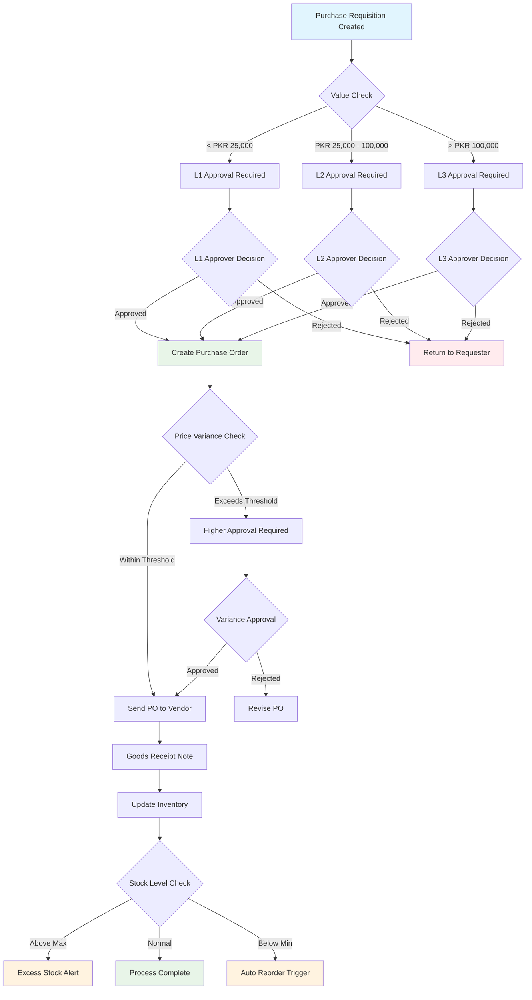
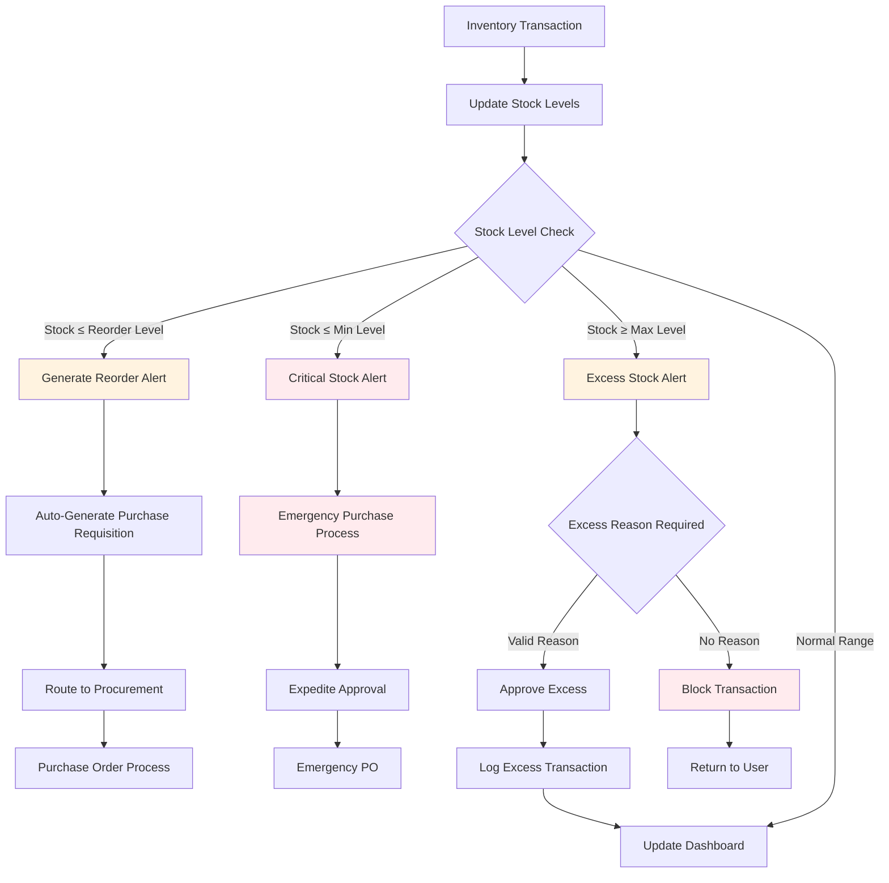
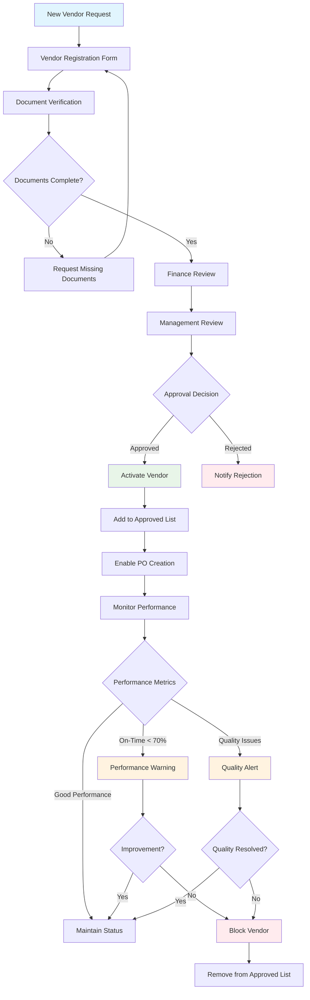
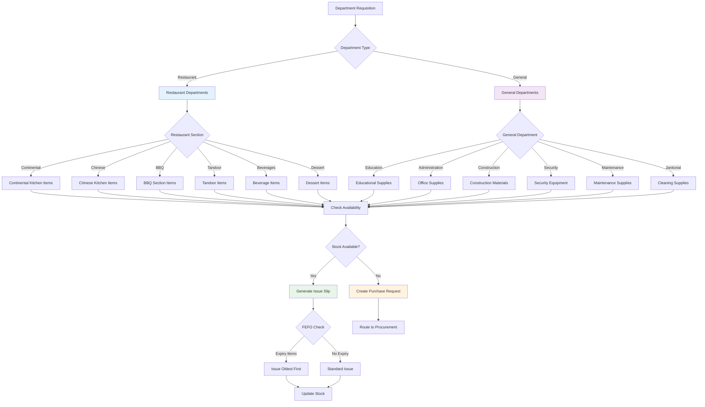
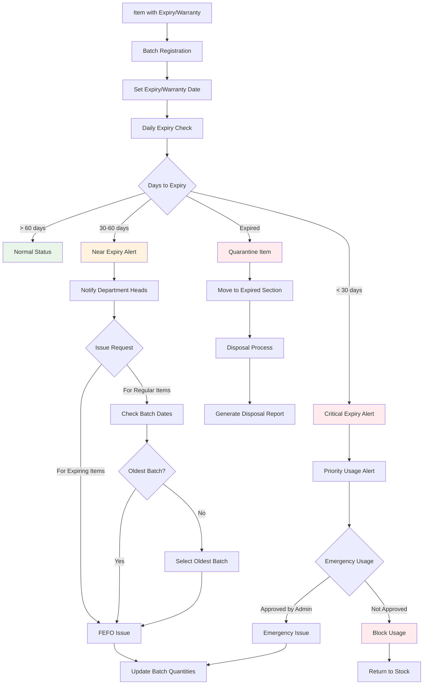
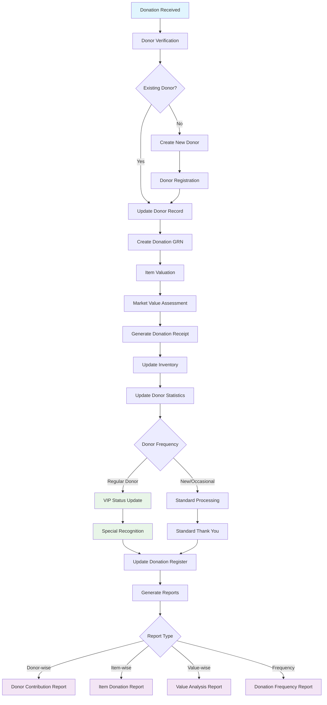
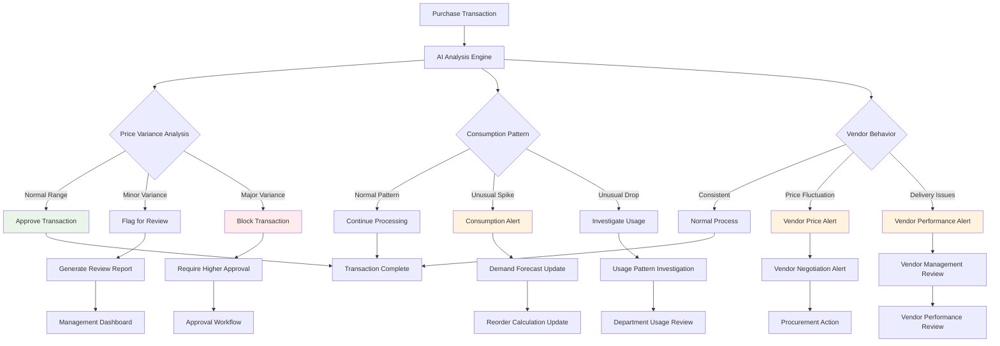
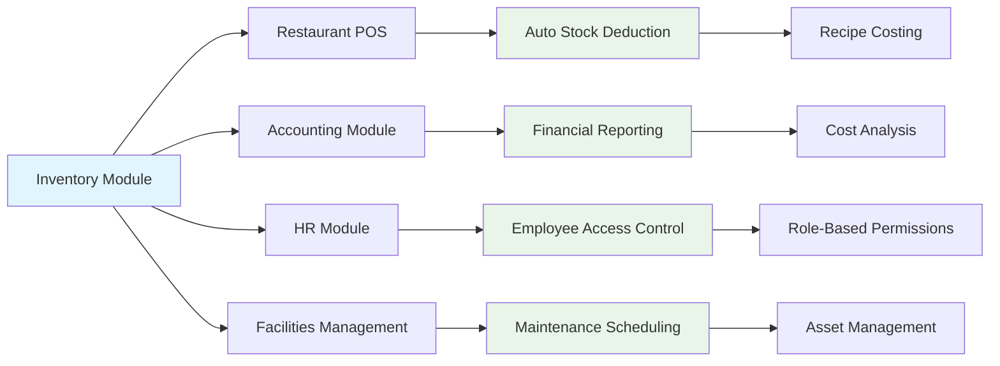
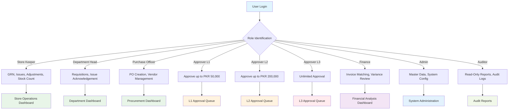

# Inventory Management Workflows
## Rahah24 ERP - Jamia Binoria Aalamia

**Mermaid Diagrams for Complete Inventory System Workflows**

---

## 1. **Purchase Approval Workflow (Module 2)**
*3-Level approval system based on value thresholds*



## 2. **Stock Level Control Workflow (Module 1)**
*Automated reorder suggestions and excess handling*



## 3. **Vendor Management Workflow (Module 3)**
*Vendor approval and performance tracking*



## 4. **Department Requisition Workflow (Module 4)**
*Restaurant and General department requisitions*



## 5. **Physical Stock Count Workflow (Module 9)**
*Scheduled cycle counts and variance reconciliation*

```mermaid
flowchart TD
    A[Physical Count Schedule] --> B{Count Type}
    
    B -->|Cycle Count| C[Select Items by Category]
    B -->|Full Count| D[Count All Items]
    
    C --> E[Generate Count Sheet]
    D --> E
    
    E --> F[Assign to Store Keeper]
    F --> G[Physical Counting]
    
    G --> H[Enter Count Data]
    H --> I[System vs Physical]
    
    I --> J{Variance Found?}
    J -->|No| K[Count Verified]
    J -->|Yes| L{Variance Type}
    
    L -->|Minor (< 5%)| M[Auto Adjustment]
    L -->|Major (≥ 5%)| N[Investigation Required]
    
    N --> O{Investigation Result}
    O -->|Theft| P[File Theft Report]
    O -->|Damage| Q[Create Damage Report]
    O -->|Counting Error| R[Recount Required]
    O -->|System Error| S[IT Investigation]
    
    P --> T[Police Report + Adjustment]
    Q --> U[Insurance Claim + Adjustment]
    R --> G
    S --> V[System Correction]
    
    M --> W[Update Inventory]
    T --> W
    U --> W
    V --> W
    
    K --> W
    W --> X[Generate Count Report]
    
    style K fill:#e8f5e8
    style P fill:#ffebee
    style Q fill:#fff3e0
    style R fill:#e1f5fe
    style S fill:#f3e5f5
```

## 6. **Expiry & Warranty Tracking Workflow (Module 7)**
*FEFO enforcement and warranty management*



## 7. **Donation Tracking Workflow (Module 10)**
*Donor management and donation processing*



## 8. **AI-Powered Purchase Analysis Workflow (Module 12)**
*Intelligent anomaly detection and recommendations*



---

## **Workflow Integration Points**

### **System Integration Map**


### **Role-Based Access Matrix**


---

## **Implementation Notes for Obsidian**

### **Workflow Linking Strategy**
- Each workflow diagram represents one of the 14 modules from INVENTORY MODULE.pdf
- Workflows are interconnected through shared data points and trigger events
- Color coding indicates workflow status and priority levels
- Integration points show how inventory connects with other ERP modules

### **Mermaid Syntax Benefits**
- **Live Editing**: Diagrams update automatically in Obsidian
- **Cross-Referencing**: Easy linking between workflows and documentation
- **Version Control**: Diagram changes tracked in Git alongside code
- **Export Options**: Can export to PNG/SVG for presentations

### **Navigation Structure**
```
docs/
├── INVENTORY_DEVELOPMENT_PLAN.md
├── INVENTORY_WORKFLOWS.md (this file)
├── modules/
│   └── inventory.md
└── workflows/
    ├── purchase-approval.md
    ├── stock-management.md
    ├── vendor-management.md
    └── department-requisitions.md
```

*These workflows provide complete visualization of all inventory processes for the comprehensive frontend implementation in Rahah24 ERP.*