# Inventory Management System - Architecture Documentation
## Rahah24 ERP - Operations Module

---

**Document Version**: 1.0
**Last Updated**: October 25, 2025
**Status**: Active Development
**Author**: Rahah24 Development Team

---

## 📋 Table of Contents

1. [System Architecture Overview](#system-architecture-overview)
2. [Component Architecture](#component-architecture)
3. [Data Flow Architecture](#data-flow-architecture)
4. [Deployment Architecture](#deployment-architecture)
5. [Security Architecture](#security-architecture)
6. [Integration Architecture](#integration-architecture)
7. [Scalability & Performance](#scalability--performance)

---

## 🏗️ System Architecture Overview

### High-Level System Architecture

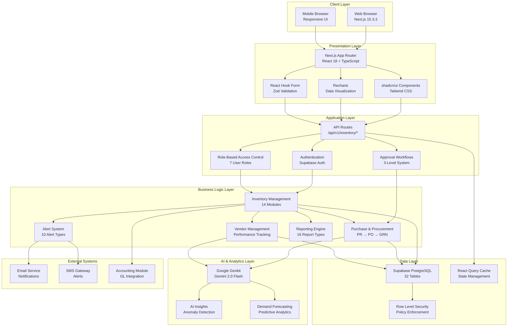

### Technology Stack Summary

| Layer | Technology | Purpose |
|-------|-----------|---------|
| **Frontend** | Next.js 15.3.3 + React 18 | Server-side rendering, routing |
| **UI Framework** | Tailwind CSS + shadcn/ui | Component library, styling |
| **State Management** | Tanstack React Query | Server state, caching |
| **Database** | Supabase PostgreSQL 17.4.1 | Primary data store |
| **Authentication** | Supabase Auth | User authentication |
| **AI/ML** | Google Genkit + Gemini 2.0 | Insights, forecasting |
| **Charts** | Recharts | Data visualization |
| **Forms** | React Hook Form + Zod | Form handling, validation |
| **Icons** | Lucide React | Icon library |

---

## 🧩 Component Architecture

### Frontend Component Hierarchy

```mermaid
graph TD
    subgraph "Root Layout"
        APP[app/layout.tsx<br/>Theme Provider]
    end

    subgraph "Dashboard Module"
        DASH[dashboard/page.tsx<br/>Executive Dashboard]
        DASHKPI[KPI Cards Component]
        DASHCHARTS[Chart Components]
        DASHTABLE[Data Tables]
    end

    subgraph "Inventory Module"
        INV_LAYOUT[inventory/layout.tsx<br/>Inventory Navigation]

        subgraph "Stock Management"
            STOCK_LIST[Stock List View]
            STOCK_DETAIL[Item Detail View]
            STOCK_ADJ[Stock Adjustment Form]
            STOCK_LEVELS[Min/Max Configuration]
        end

        subgraph "Purchase Management"
            PR_LIST[Purchase Requisitions]
            PR_FORM[Create PR Form]
            PO_LIST[Purchase Orders]
            PO_FORM[Create PO Form]
            GRN_LIST[Goods Receipt Notes]
            GRN_FORM[GRN Processing]
        end

        subgraph "Vendor Management"
            VENDOR_LIST[Vendor Directory]
            VENDOR_DETAIL[Vendor Profile]
            VENDOR_PERF[Performance Dashboard]
            VENDOR_FORM[Vendor Registration]
        end

        subgraph "Department Requisitions"
            DEPT_REQ[Requisition List]
            DEPT_FORM[Create Requisition]
            DEPT_ISSUE[Issue Slip]
            DEPT_APPROVE[Approval Workflow]
        end

        subgraph "Reporting"
            REPORT_LIST[Report Directory]
            REPORT_VIEW[Report Viewer]
            REPORT_EXPORT[Export Manager]
        end
    end

    subgraph "Shared Components"
        UI_BUTTON[Button]
        UI_FORM[Form Controls]
        UI_TABLE[Data Table]
        UI_DIALOG[Dialog/Modal]
        UI_CARD[Card]
        UI_CHART[Chart Wrapper]
        UI_ALERT[Alert/Toast]
    end

    APP --> DASH
    APP --> INV_LAYOUT
    DASH --> DASHKPI
    DASH --> DASHCHARTS
    DASH --> DASHTABLE
    INV_LAYOUT --> STOCK_LIST
    INV_LAYOUT --> PR_LIST
    INV_LAYOUT --> VENDOR_LIST
    INV_LAYOUT --> DEPT_REQ
    INV_LAYOUT --> REPORT_LIST
    STOCK_LIST --> STOCK_DETAIL
    STOCK_DETAIL --> STOCK_ADJ
    STOCK_DETAIL --> STOCK_LEVELS
    PR_LIST --> PR_FORM
    PR_LIST --> PO_LIST
    PO_LIST --> PO_FORM
    PO_LIST --> GRN_LIST
    GRN_LIST --> GRN_FORM
    VENDOR_LIST --> VENDOR_DETAIL
    VENDOR_DETAIL --> VENDOR_PERF
    VENDOR_LIST --> VENDOR_FORM
    DEPT_REQ --> DEPT_FORM
    DEPT_REQ --> DEPT_ISSUE
    DEPT_REQ --> DEPT_APPROVE
    REPORT_LIST --> REPORT_VIEW
    REPORT_VIEW --> REPORT_EXPORT
    DASHKPI --> UI_CARD
    PR_FORM --> UI_FORM
    STOCK_LIST --> UI_TABLE
    STOCK_ADJ --> UI_DIALOG
    DASHCHARTS --> UI_CHART
    DEPT_APPROVE --> UI_ALERT
```

### API Route Architecture

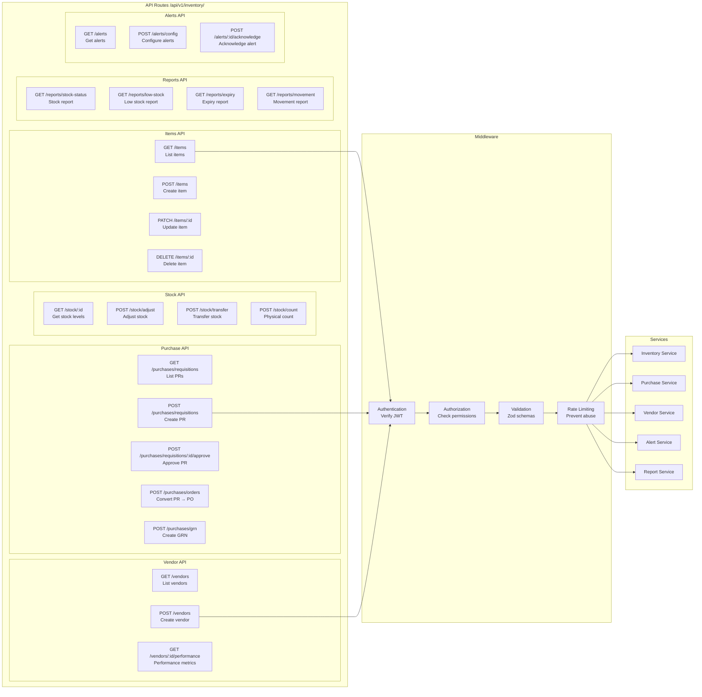

---

## 🔄 Data Flow Architecture

### Purchase Requisition to Invoice Flow

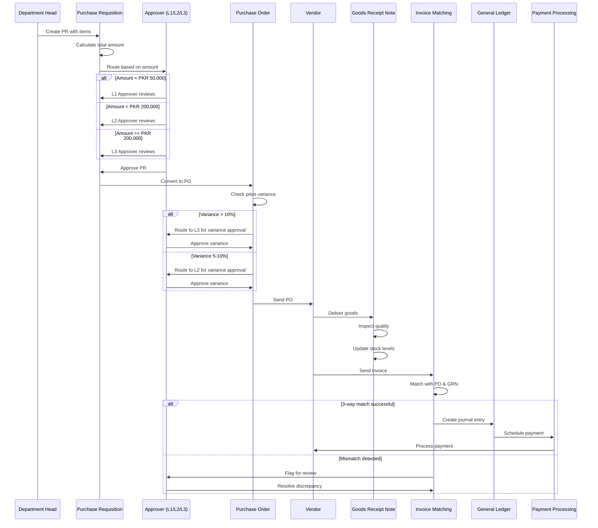

### Stock Movement Flow

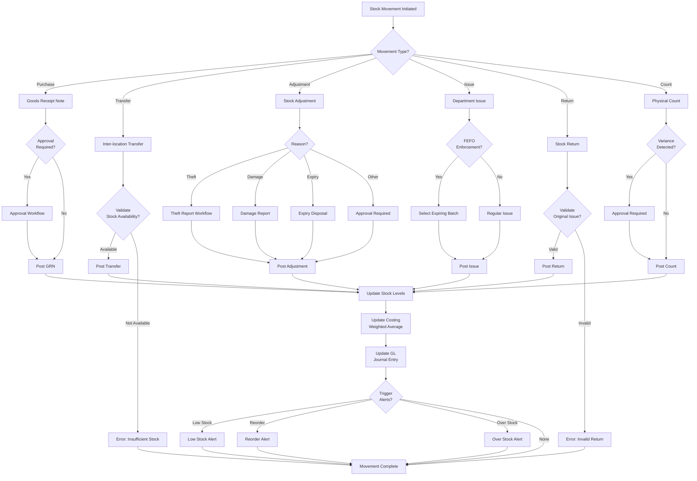

### Alert System Flow

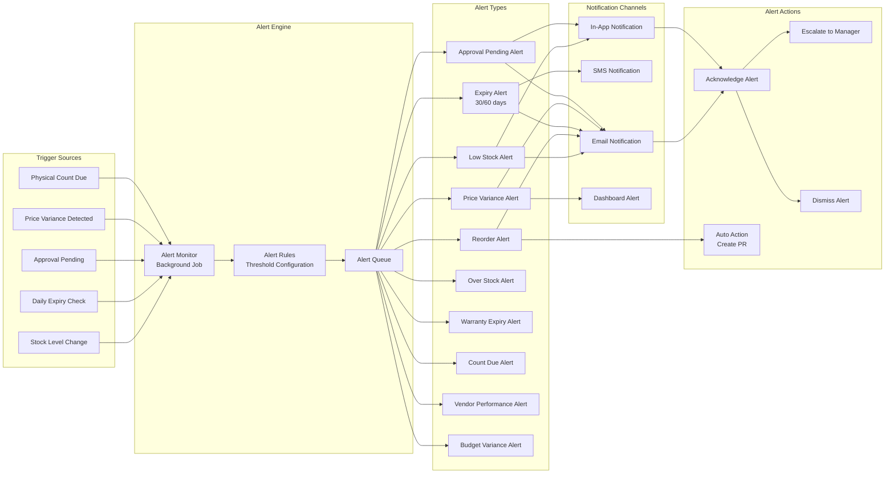

---

## 🚀 Deployment Architecture

### Cloud Infrastructure (Vercel + Supabase)

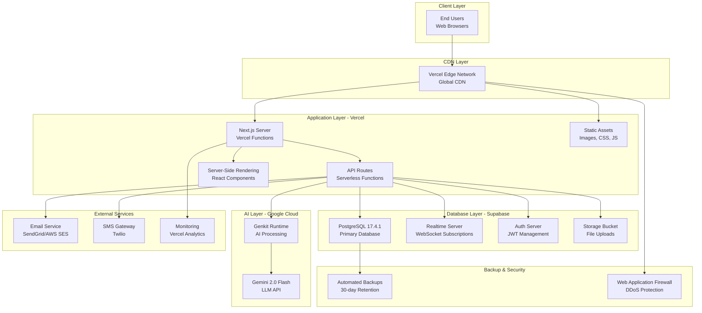

### Deployment Pipeline

```mermaid
flowchart LR
    subgraph "Development"
        DEV_CODE[Local Development<br/>npm run dev]
        DEV_TEST[Unit Tests<br/>Jest + RTL]
        DEV_LINT[Linting<br/>ESLint]
        DEV_TYPE[Type Check<br/>TypeScript]
    end

    subgraph "Version Control"
        GIT[Git Repository<br/>GitHub]
        BRANCH[Feature Branch]
        PR[Pull Request]
        REVIEW[Code Review]
    end

    subgraph "CI/CD Pipeline"
        CI[GitHub Actions<br/>Continuous Integration]
        BUILD[Build<br/>next build]
        TEST[Test Suite<br/>Integration Tests]
        ANALYZE[Bundle Analysis<br/>Size Check]
    end

    subgraph "Staging Environment"
        STAGE_DEPLOY[Deploy to Staging<br/>Vercel Preview]
        STAGE_TEST[E2E Testing<br/>Playwright]
        STAGE_QA[QA Review<br/>Manual Testing]
    end

    subgraph "Production Environment"
        PROD_APPROVE[Production Approval<br/>Manual Gate]
        PROD_DEPLOY[Deploy to Production<br/>Vercel]
        PROD_MONITOR[Production Monitoring<br/>Error Tracking]
        PROD_ROLLBACK[Rollback Strategy<br/>Previous Version]
    end

    DEV_CODE --> DEV_TEST
    DEV_TEST --> DEV_LINT
    DEV_LINT --> DEV_TYPE
    DEV_TYPE --> GIT
    GIT --> BRANCH
    BRANCH --> PR
    PR --> REVIEW
    REVIEW --> CI
    CI --> BUILD
    BUILD --> TEST
    TEST --> ANALYZE
    ANALYZE --> STAGE_DEPLOY
    STAGE_DEPLOY --> STAGE_TEST
    STAGE_TEST --> STAGE_QA
    STAGE_QA --> PROD_APPROVE
    PROD_APPROVE --> PROD_DEPLOY
    PROD_DEPLOY --> PROD_MONITOR
    PROD_MONITOR -->|Error Detected| PROD_ROLLBACK
    PROD_ROLLBACK -->|Rollback| PROD_DEPLOY
```

---

## 🔒 Security Architecture

### Authentication & Authorization Flow

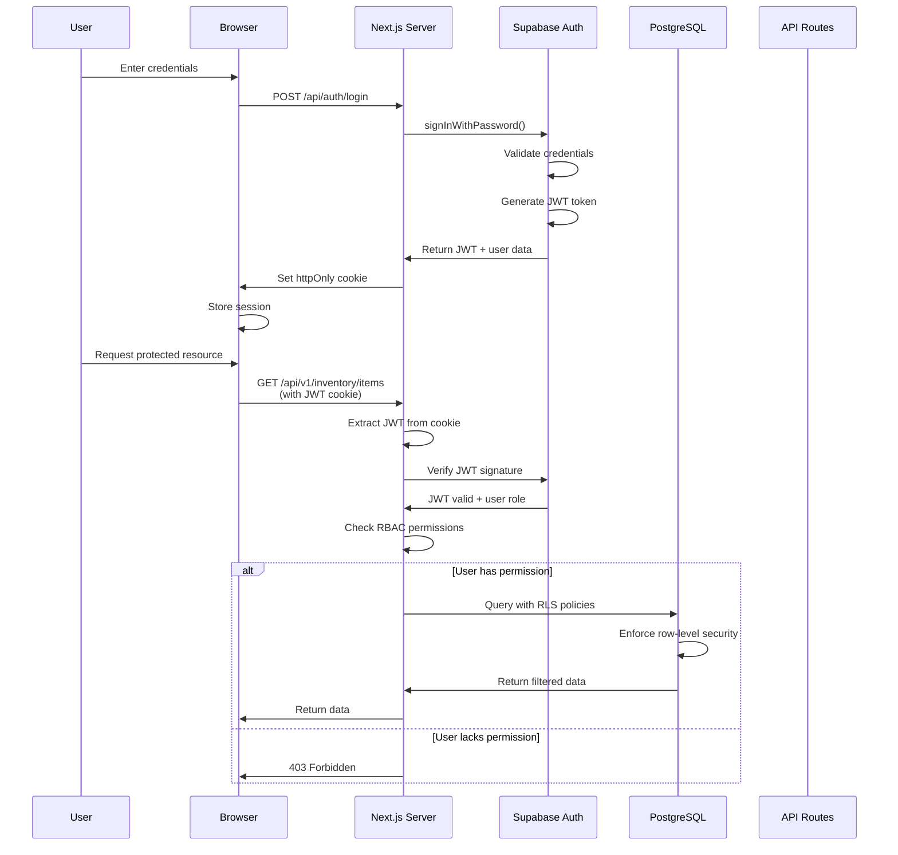

### Row-Level Security (RLS) Architecture

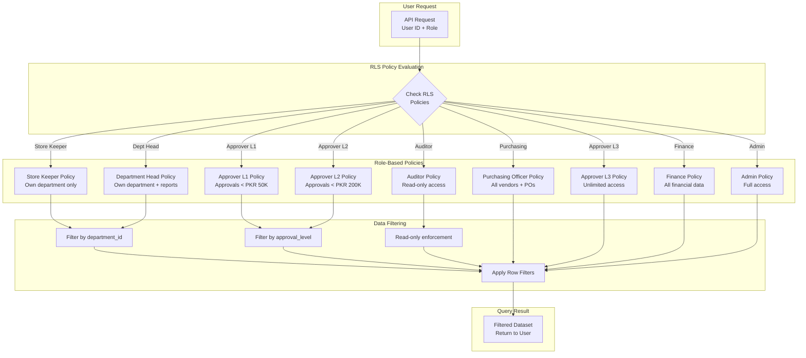

### Data Encryption Architecture

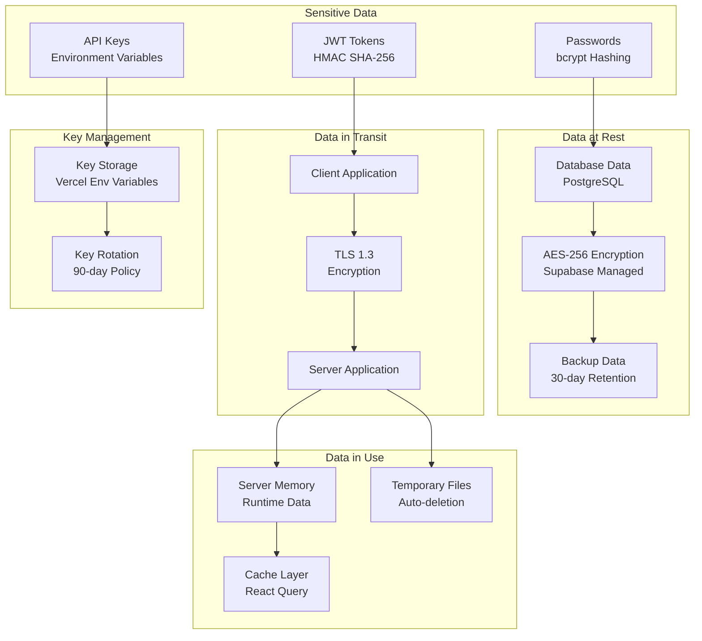

---

## 🔗 Integration Architecture

### External System Integrations

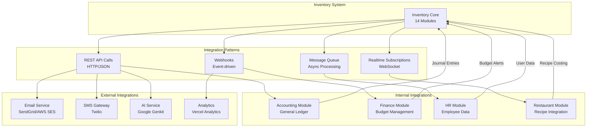

### Event-Driven Architecture

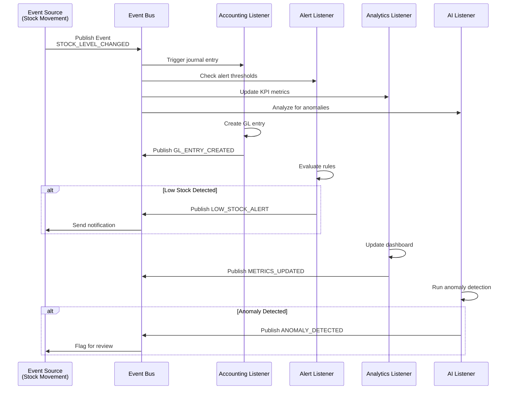

---

## 📈 Scalability & Performance

### Caching Strategy

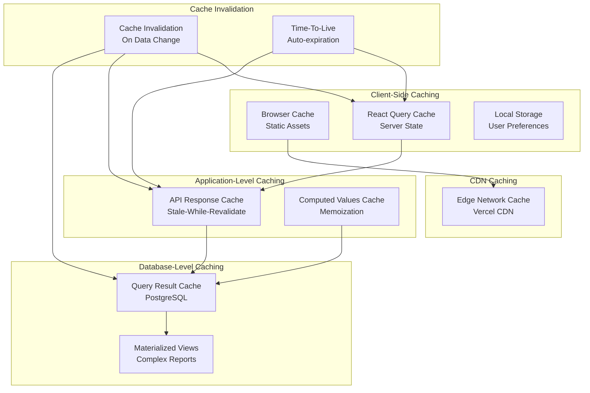

### Database Optimization Strategy

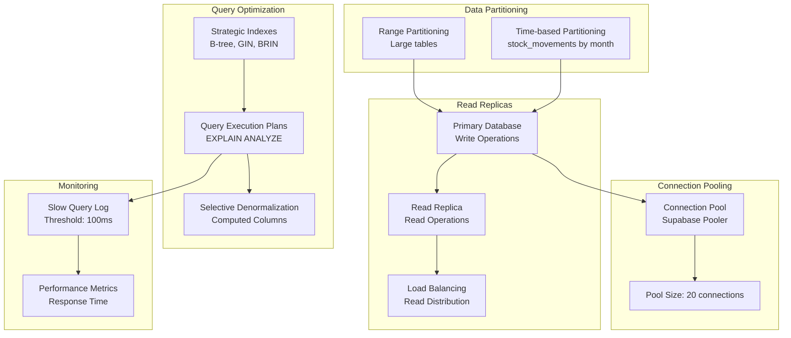

### Scalability Model

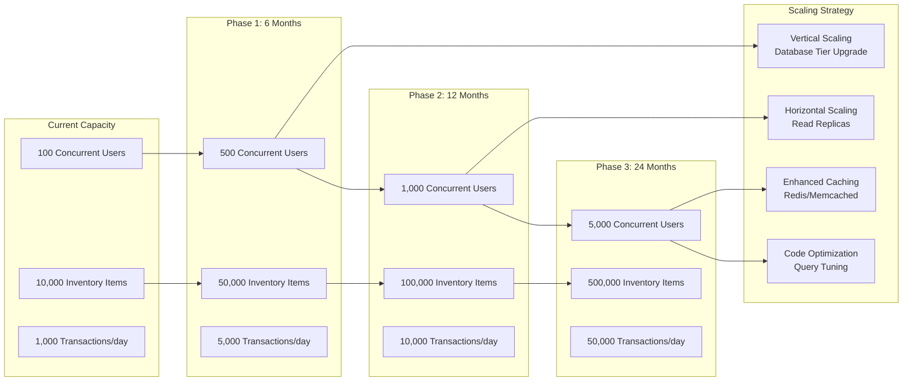

---

## 📊 Performance Targets

### Response Time SLAs

| Operation | Target | Acceptable | Critical |
|-----------|--------|------------|----------|
| **Page Load** | < 1s | < 2s | < 3s |
| **API Call (Simple)** | < 100ms | < 200ms | < 500ms |
| **API Call (Complex)** | < 500ms | < 1s | < 2s |
| **Report Generation** | < 2s | < 5s | < 10s |
| **Search Results** | < 200ms | < 500ms | < 1s |
| **Dashboard Refresh** | < 1s | < 2s | < 3s |

### Availability Targets

- **Uptime SLA**: 99.9% (8.76 hours/year downtime)
- **Planned Maintenance**: < 2 hours/month
- **MTTR (Mean Time To Recovery)**: < 1 hour
- **RPO (Recovery Point Objective)**: < 1 hour
- **RTO (Recovery Time Objective)**: < 4 hours

---

## 🔄 Disaster Recovery Plan

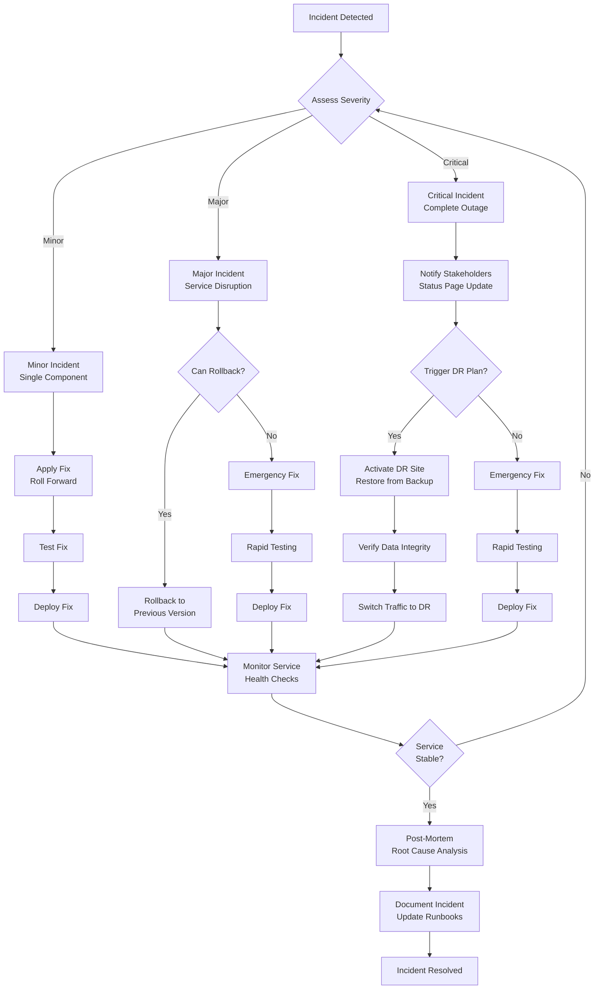

---

## 📝 Architecture Decision Records (ADRs)

### ADR-001: Next.js App Router vs Pages Router

**Status**: Accepted
**Date**: October 25, 2025

**Context**: Need to choose between Next.js App Router (new) and Pages Router (legacy).

**Decision**: Use Next.js App Router with React Server Components.

**Rationale**:
- Better performance with server-side rendering
- Improved data fetching patterns
- Built-in loading states and error handling
- Future-proof architecture

**Consequences**:
- Steeper learning curve for developers
- Some third-party libraries may need compatibility updates
- Better long-term maintainability

---

### ADR-002: Supabase vs Self-Hosted PostgreSQL

**Status**: Accepted
**Date**: October 25, 2025

**Context**: Need to choose database hosting strategy.

**Decision**: Use Supabase managed PostgreSQL.

**Rationale**:
- Built-in authentication and authorization
- Automatic backups and point-in-time recovery
- Row-level security (RLS) out of the box
- Realtime subscriptions for live updates
- Reduced operational overhead

**Consequences**:
- Vendor lock-in to Supabase
- Dependency on Supabase availability
- Cost increases with scale (predictable pricing)

---

### ADR-003: REST API vs GraphQL

**Status**: Accepted
**Date**: October 25, 2025

**Context**: Need to choose API architecture pattern.

**Decision**: Use REST API with standardized JSON responses.

**Rationale**:
- Simpler to implement and maintain
- Better caching with HTTP standards
- Supabase client already provides efficient querying
- Team familiarity with REST patterns
- Easier to version and evolve

**Consequences**:
- May require multiple API calls for complex queries
- Over-fetching of data in some scenarios
- Simpler debugging and monitoring

---

### ADR-004: Client-Side vs Server-Side Rendering

**Status**: Accepted
**Date**: October 25, 2025

**Context**: Need to balance performance and interactivity.

**Decision**: Use hybrid approach - SSR for initial load, CSR for interactions.

**Rationale**:
- Fast initial page load with SSR
- Interactive features with client-side state
- SEO benefits for dashboards and reports
- Leverage Next.js strengths

**Consequences**:
- More complex data fetching patterns
- Need to manage client/server state separately
- Better user experience overall

---

### ADR-005: AI Integration with Google Genkit vs Direct API

**Status**: Accepted
**Date**: October 25, 2025

**Context**: Need to integrate AI for insights and forecasting.

**Decision**: Use Google Genkit with Gemini 2.0 Flash model.

**Rationale**:
- Structured AI workflows with type safety
- Built-in tracing and debugging
- Easy integration with Next.js
- Cost-effective pricing
- High-quality results from Gemini

**Consequences**:
- Learning curve for Genkit framework
- Dependency on Google AI infrastructure
- Excellent developer experience for AI features

---

## 🎯 Future Architecture Enhancements

### Planned Improvements (Next 6 Months)

1. **Microservices Architecture**
   - Split inventory system into independent services
   - Implement message queue (RabbitMQ/AWS SQS)
   - Enable independent scaling

2. **Enhanced Caching**
   - Implement Redis for distributed caching
   - Add CDN edge caching for API responses
   - Optimize cache invalidation strategies

3. **Multi-Tenancy Support**
   - Implement tenant isolation at database level
   - Add tenant-specific configurations
   - Support multiple organizations

4. **Mobile Applications**
   - Native iOS/Android apps for inventory management
   - Offline-first architecture with sync
   - Barcode scanning integration

5. **Advanced Analytics**
   - Real-time dashboard with WebSocket updates
   - Predictive analytics for demand forecasting
   - Machine learning for price optimization

6. **Integration Marketplace**
   - Plugin architecture for third-party integrations
   - Webhook management interface
   - API marketplace for extensions

---

## 📞 Architecture Review & Governance

### Architecture Review Board

- **Frequency**: Quarterly
- **Participants**: Tech Lead, Senior Developers, Product Owner
- **Scope**: Review ADRs, assess technical debt, plan improvements

### Architecture Documentation

- **Location**: `docs/modules/operations/inventory/ARCHITECTURE.md`
- **Update Frequency**: On major changes
- **Review Process**: Peer review required for architecture changes

---

**Document Version**: 1.0
**Last Updated**: October 25, 2025
**Next Review**: January 25, 2026
**Owner**: Rahah24 Development Team

---

*InshAllah, this architecture will provide a solid foundation for scaling the inventory management system while maintaining security, performance, and reliability.*
